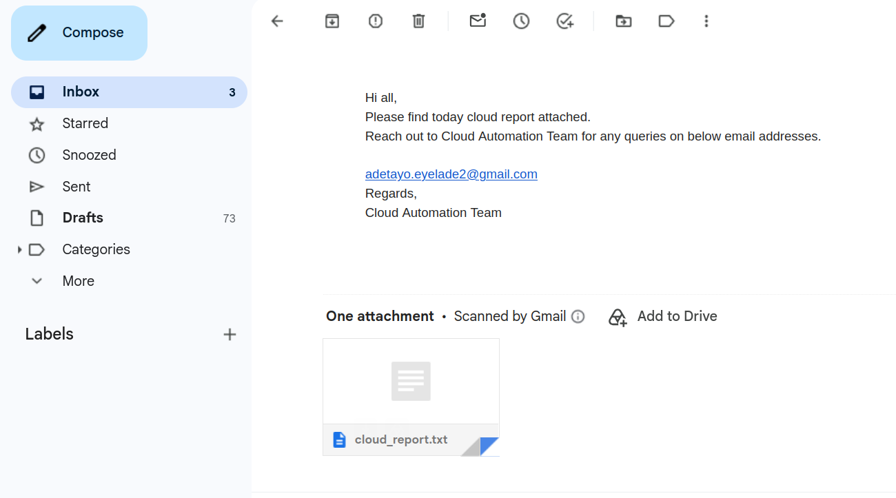
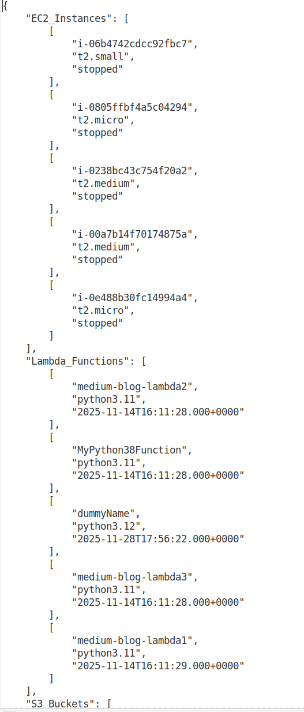
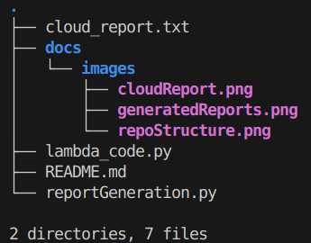

# AWS Cloud Inventory Reporting Automation


Automates recurring AWS infrastructure inventory by collecting metadata from Amazon EC2, AWS Lambda, and Amazon S3, generating a structured JSON report, and delivering it to stakeholders through Amazon SES.

The project mirrors a production cloud operations workflow used for governance, compliance reviews, cost visibility, and infrastructure reporting without requiring engineers to manually inspect multiple AWS services.

---

## Table of Contents

- [Project Output](#project-output)
- [Architecture](#architecture)
- [Project Highlights](#project-highlights)
- [Tech Stack](#tech-stack)
- [Engineering Decisions](#engineering-decisions)
- [Repository Structure](#repository-structure)
- [Setup and Usage](#setup-and-usage)
- [Challenges and Fixes](#challenges-and-fixes)
- [Future Improvements](#future-improvements)
- [Skills Demonstrated](#skills-demonstrated)
- [Author](#author)

---

# Project Output

The automation inventories AWS resources, generates a consolidated JSON report, and automatically emails it to stakeholders.

## Email Notification


## Generated Report


# Architecture

```text
                Amazon EventBridge
               Scheduled Trigger
                      │
                      ▼
               AWS Lambda Function
              Inventory Collection
                      │
        ┌─────────────┼─────────────┐
        ▼             ▼             ▼
   Amazon EC2    AWS Lambda     Amazon S3
DescribeInstances ListFunctions ListBuckets
        └─────────────┼─────────────┘
                      ▼
         Consolidated JSON Report
         /tmp/cloud_report.txt
                      │
                      ▼
               Amazon SES Email
                      │
                      ▼
           Stakeholder Email Inbox
```

# Project Highlights

- Automated AWS inventory reporting across EC2, Lambda, and S3
- Local CLI implementation and AWS Lambda deployment
- Scheduled execution with Amazon EventBridge
- Automated email delivery through Amazon SES
- Structured exception handling for operational visibility
- Least-privilege IAM implementation
- Production-style serverless automation workflow

---

# Tech Stack

- Python 3
- boto3
- AWS Lambda
- Amazon EventBridge
- Amazon EC2
- Amazon S3
- Amazon SES
- AWS IAM
- JSON
- Python `email.mime`

---

# Engineering Decisions

### Used AWS Lambda instead of Amazon EC2

Since the workload only runs on a schedule, AWS Lambda eliminates infrastructure management and reduces operational cost compared to maintaining an always-on EC2 instance.

### Used EventBridge for scheduling

Amazon EventBridge provides fully managed scheduling without relying on cron jobs or dedicated servers.

### Used Lambda's `/tmp` storage

AWS Lambda only allows write operations within `/tmp`. Since the report is generated and emailed during the same invocation, temporary storage keeps the workflow simple.

### Maintained two execution models

The repository includes both a standalone Python application and a Lambda implementation, allowing local development while supporting production deployment.

### Implemented structured exception handling

Failures return consistent responses and are logged to CloudWatch, improving operational visibility and troubleshooting.

---

# Repository Structure



| File | Description |
|------|-------------|
| `reportGeneration.py` | Standalone Python implementation |
| `lambda_code.py` | AWS Lambda implementation |
| `cloud_report.txt` | Example generated report |
| `docs/images` | Screenshots used in the README |


---

# Setup and Usage

## Clone the repository

```bash
git clone https://github.com/Evatee-coder/aws-cloud-inventory-reporting.git

cd aws-cloud-inventory-reporting
```

## Create a virtual environment

```bash
python3 -m venv .venv

source .venv/bin/activate
```

## Install dependencies

```bash
pip install boto3
```

## Configure Amazon SES

Verify the sender identity (or domain).

If your SES account is in the sandbox, verify the recipient email address as well.

## Run locally

```bash
python3 reportGeneration.py
```

---

# Challenges and Fixes

### Lambda filesystem restrictions

AWS Lambda provides a read-only execution environment except for `/tmp`.

**Resolution**

Stored generated reports in `/tmp/cloud_report.txt` while preserving local filesystem support for the standalone application.

---

### JSON serialization failures

Amazon S3 returns bucket creation dates as `datetime` objects that cannot be serialized directly to JSON.

**Resolution**

```python
json.dump(report_data, report_file, indent=4, default=str)
```

---

### Operational visibility

Unhandled exceptions resulted in inconsistent failures and limited troubleshooting information.

**Resolution**

Implemented structured exception handling with consistent status responses and CloudWatch logging.

---

# Future Improvements

- Provision the solution with Terraform
- Store configuration in AWS Systems Manager Parameter Store or AWS Secrets Manager
- Add pagination support for large AWS accounts
- Store historical reports in Amazon S3
- Generate HTML and CSV reports
- Add automated unit tests with `pytest` and `moto`
- Build a GitHub Actions CI/CD pipeline
- Publish CloudWatch metrics and alarms

---

# Skills Demonstrated

- AWS SDK development with boto3
- Serverless application development
- Event-driven architecture
- AWS Lambda runtime optimization
- IAM least-privilege design
- Python automation
- JSON data modeling
- MIME email generation
- Cloud operations automation
- Exception handling and observability

---

# Author

**Victor Adetayo Eyelade**

- GitHub: https://github.com/Evatee-coder
- LinkedIn: https://www.linkedin.com/in/victor-adetayo-eyelade-a98606128/